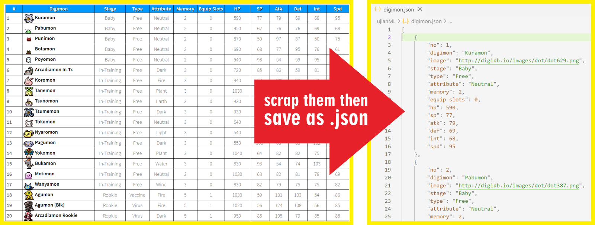
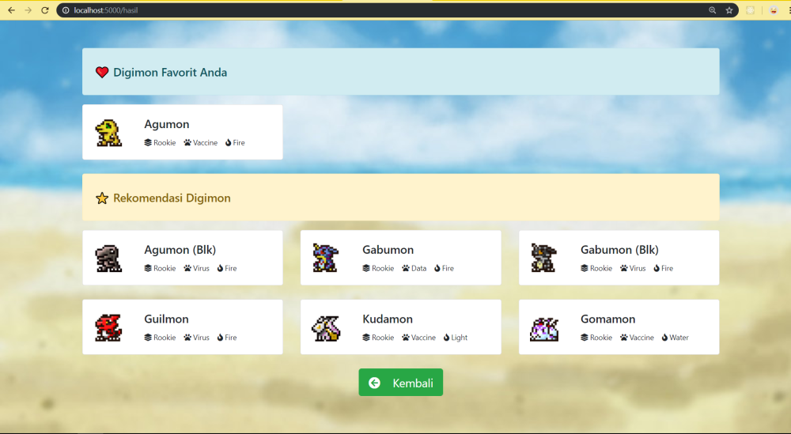

# Soal Ujian Data Science - Machine Learning


## **Soal 1 - Hunting Pemain Bola ⚽**


Anda adalah seorang manager klub sepakbola ternama yang ingin merekrut pemain sepakbola muda berbakat. Pemain yang Anda targetkan untuk direkrut memiliki kriteria sebagai berikut:

- [x] Usia (__Age__) __<= 25__ tahun, 
- [x] Skill umum (__Overall__) __>= 80__ point, dan
- [x] Potensi (__Potential__) __>= 80__ point. 

Tersedia __1 buah dataset (.csv)__ yang memuat data lengkap pemain sepakbola profesional kelas dunia. Unduh dataset via Kaggle: [klik di sini](https://www.kaggle.com/karangadiya/fifa19). __Dilarang keras untuk menyunting/mengubah konten dataset!__ 

Dengan memanfaatkan dataset tersebut, buatlah sebuah file __python (.py)__ atau kernel __Jupyter notebook (.ipynb)__ yang berisi model Machine Learning yang dapat mengklasifikasikan pemain yang Anda targetkan untuk direkrut. Gunakan minimal __3 buah algoritma model machine learning__ _(pilihan model bebas)_, lalu bandingkan & tentukan model mana yang memiliki akurasi terbaik. Kemudian gunakan model tersebut untuk mengklasifikasikan data __pemain di bawah ini__ apakah tergolong pemain yang patut Anda rekrut atau tidak:

Name | Club | Nationality | Age | Overall | Potential
--|--|--|--|--|--
Andik Vermansyah | Madura United FC |  Indonesia | 27 | 87 | 90
Awan Setho Raharjo | Bhayangkara FC |  Indonesia | 22 | 75 | 83
Bambang Pamungkas | Persija Jakarta |  Indonesia | 38 | 85 | 75
Cristian Gonzales | PSS Sleman |  Indonesia | 43 | 90 | 85
Egy Maulana Vikri | Lechia Gdańsk |  Indonesia | 18 | 88 | 90
Evan Dimas | Barito Putera |  Indonesia | 24 | 85 | 87
Febri Hariyadi | Persib Bandung |  Indonesia | 23 | 77 | 80
Hansamu Yama Pranata | Persebaya Surabaya |  Indonesia | 24 | 82 | 85
Septian David Maulana | PSIS Semarang |  Indonesia | 22 | 83 | 80
Stefano Lilipaly | Bali United |  Indonesia | 29 | 88 | 86

✅ _Commit & push source code jawaban soal ini ke __Github__ Anda, buatlah repo dengan nama __Ujian_Pemain_Bola__. Kemudian lampirkan __url link repo Github__ Anda via email ke lintang@purwadhika.com!_

#

                  
    

## **Soal 2 - Scraping Digimon to JSON**

Tersedia data lengkap __341 Digimon__ di laman [__DigiDB.io__](http://digidb.io/digimon-list/). Buatlah sebuah file __python (.py)__ dan gunakan teknik _web scraping_ untuk mengekstrak data di laman tersebut, kemudian _export_ semua data sebagai file __JSON (digimon.json)__ dengan struktur data sebagai berikut:

```javascript
...,
{
    "no": 46,
    "digimon": "Patamon",
    "image": "http://digidb.io/images/dot/dot096.png",
    "stage": "Rookie",
    "type": "Data",
    "attribute": "Wind",
    "memory": 4,
    "equip slots": 1,
    "hp": 880,
    "sp": 93,
    "atk": 79,
    "def": 74,
    "int": 92,
    "spd": 90
},
...
```

Ilustrasi dari proses yang diharapkan:



✅ _Commit & push source code jawaban soal ini (beserta file output __digimon.json__) ke __Github__ Anda, buatlah repo dengan nama __Ujian_Digimon_Json__, kemudian lampirkan __url link repo Github__ Anda via email ke lintang@purwadhika.com!_

#

                  
    


## **Soal 3 - Digimon Recommendation**

Dengan memanfaatkan file output __digimon.json__ dari _Soal 2_ di atas, buatlah sebuah __*content-based filtering recommender system*__ dengan menggunakan __aplikasi Flask__, yang dapat memfasilitasi user untuk menyebutkan Digimon favoritnya & menyajikan rekomendasi __6 Digimon__ berdasarkan feature: __stage__, __type__ & __attribute__ Digimon. Aplikasi yang dibuat harus memenuhi syarat minimal berikut:

1. Server aplikasi akan berjalan di __localhost:5000__ dan ketika user melakukan GET request via browser akan tampil sebuah halaman __HTML__ sederhana yang memuat __1 buah text input__ dan __1 buah button__. Desain tampilan HTML tidak harus sama seperti contoh soal, utamakan fitur!

    

2. User dapat memasukkan nama Digimon favoritnya ke dalam text input yang sudah disediakan. Saat user menekan tombol __"Submit"__, aplikasi akan mengambil data Digimon favorit user di file __digimon.json__. Jika data ditemukan, maka user akan di-redirect ke __localhost:5000/hasil__ yang berisi halaman __HTML__, yang menampilkan data seputar Digimon favorit user, disertai dengan data __6 Digimon__ yang direkomendasikan berdasarkan __stage__, __type__ & __attribute__-nya. Data yang ditampilkan untuk tiap Digimon minimal hanya: _nama_, _gambar_, _stage_, _type_ & _attribute Digimon_. Halaman ini juga dilengkapi __1 buah button__ untuk kembali ke halaman awal. Desain tampilan HTML tidak harus sama seperti contoh soal, utamakan fitur!

    - Contoh jika user memfavoritkan __Agumon__ :
    
        

        

    - Contoh jika user memfavoritkan __Wargreymon__ :

        

        

4. Namun jika Digimon favorit user tidak ditemukan atau tidak ada di dalam file __digimon.json__, maka user akan di-redirect ke halaman __HTML__ yang memberikan informasi bahwa data tidak ditemukan. Halaman ini juga dilengkapi __1 buah button__ untuk kembali ke halaman awal. Desain tampilan HTML tidak harus sama seperti contoh soal, utamakan fitur!

    

✅ _Commit & push source code jawaban soal ini ke __Github__ Anda, buatlah repo dengan nama __Ujian_Digimon_Recommendation__, kemudian lampirkan __url link repo Github__ Anda via email ke lintang@purwadhika.com!_

#

### *__#HappyCoding__* :relaxed:

#### Lintang Wisesa :love_letter: _lintangwisesa@ymail.com_

[Facebook](https://www.facebook.com/lintangbagus) | 
[Twitter](https://twitter.com/Lintang_Wisesa) |
[Google+](https://plus.google.com/u/0/+LintangWisesa1) |
[Youtube](https://www.youtube.com/user/lintangbagus) | 
:octocat: [GitHub](https://github.com/LintangWisesa) |
[Hackster](https://www.hackster.io/lintangwisesa)